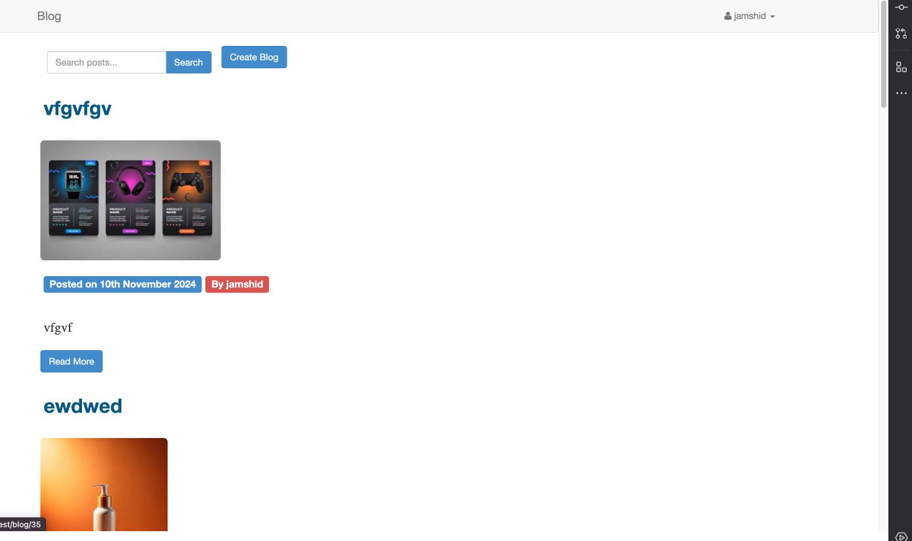
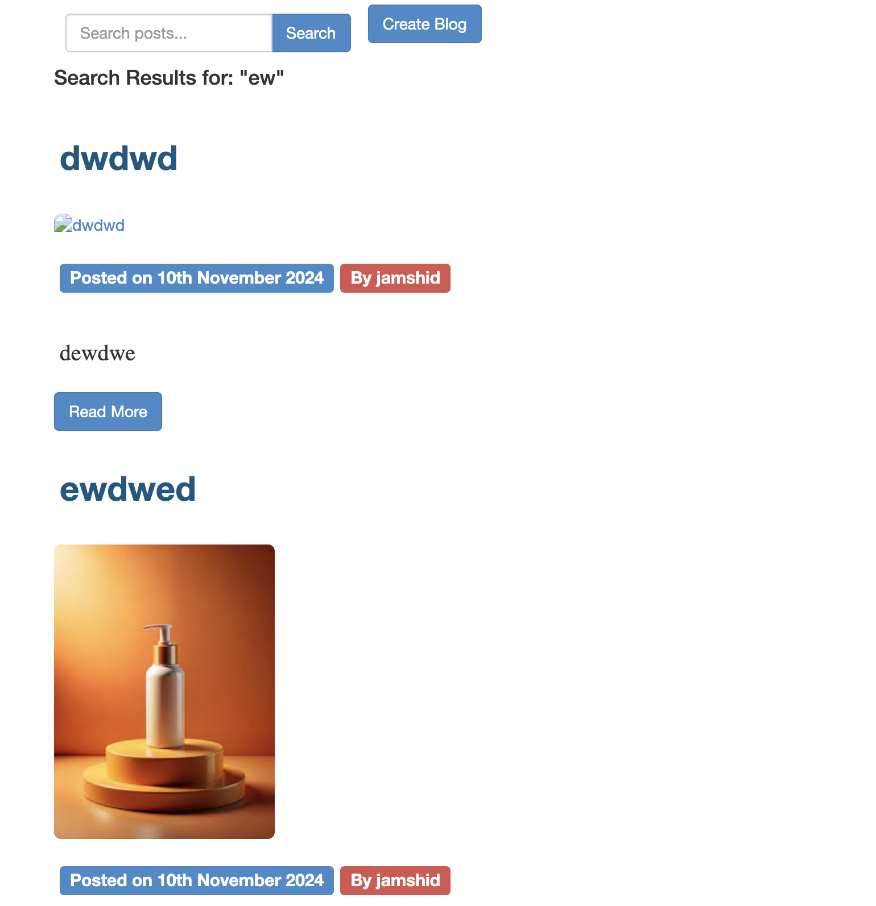
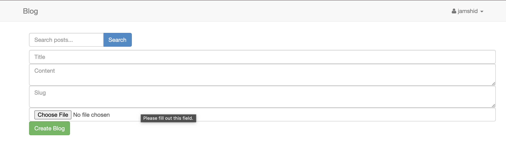
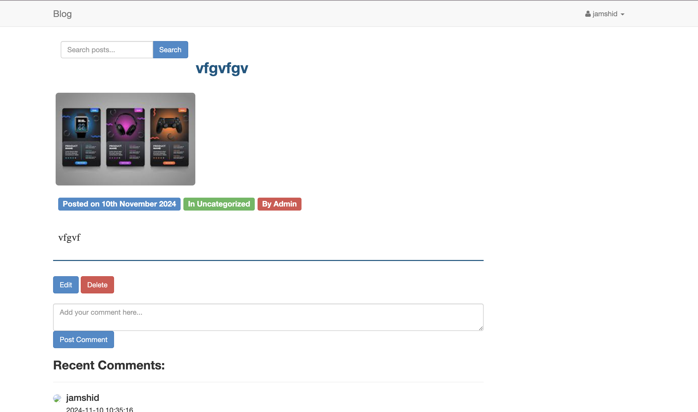
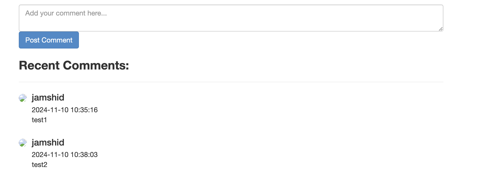
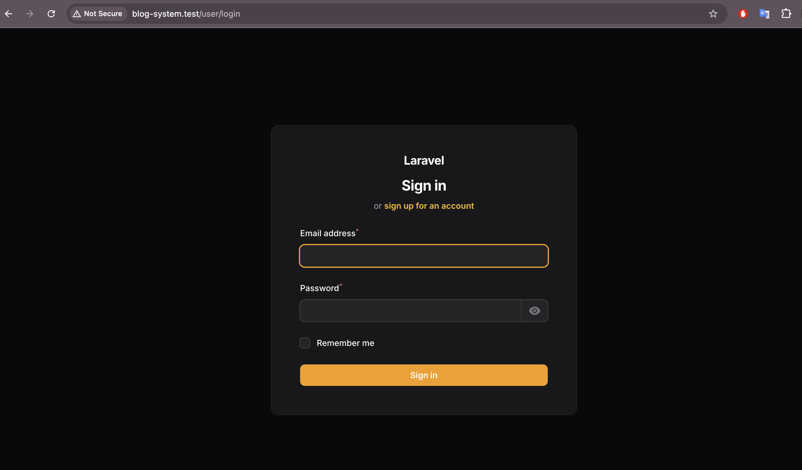

# Laravel Blog System

This is a simple Laravel-based blog system where users can create, edit, and delete blog posts. It includes user authentication and a commenting feature, allowing both authenticated and unauthenticated users to leave comments on posts.

## Features

- User Authentication (Login, Register, Logout)
- Blog post creation, editing, and deletion
- Commenting on blog posts with author name, timestamp, and content display
- Image upload and display in blog posts
- Authorization (only post owners can edit or delete their posts)
- Responsive design using Bootstrap

## Prerequisites

Ensure you have the following installed on your local machine:

- PHP 8.0 or higher
- Composer
- MySQL or another compatible database
- Node.js and npm (for frontend dependencies)

## Installation

Follow these steps to set up the project locally.

### Quick installation (herd,macos)

```bash
git clone https://github.com/your-username/blog-system.git
cd blog-system

composer install

npm install && npm run dev

DB_CONNECTION=mysql
DB_HOST=127.0.0.1
DB_PORT=3306
DB_DATABASE=blog_system
DB_USERNAME=root
DB_PASSWORD=


php artisan key:generate


php artisan migrate


php artisan storage:link


php artisan db:seed


php artisan serve
```
## Screenshots

### 1. Blog Website Overview


### 2. Search Functionality


### 3. Create -Blog


### 4. Individual Blog


### 5. Comments Section


### 6. User Registration

